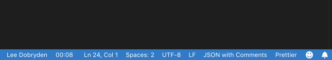

# pairodoro

Pairodoro is a timer to help better facilitate paired programming in vscode. 


## Background

Paired programming can be difficult. It is a learned and practiced skill. This plugin seeks to make it easier for individuals to pair with each other by notifying the developer when it is their turn to have their hands on the keyboard.

## Features

Provide the name of the two developers that are currently pairing, set an amount of time in seconds to pass before enforcing a pair swap, develop!

This displays the name of the developer who should currently be driving through the codebase at the bottom right of the editor and the time until a pair swap should happen. 

## Usage

When the extension is installed, the JSON below can be configured for who is pairing and the amount of time until a pair swap should occur:

``` 
  "pairodoro.player1": {
    "name": "Jonny Nabors",
    "color": "#4ef442"
  },
  "pairodoro.player2": {
    "name": "Lee Dobryden",
    "color": "#fff"
  },
  "pairodoro.seconds": 15 # How many seconds until a pair swaps
```

When your turn on the keyboard is reaching its end, you will be so notified.


